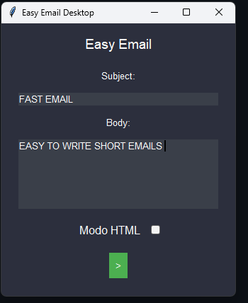

# Easy Email Desktop

A simple and modern desktop application for sending emails using the **Resend API**. Designed with a clean dark mode UI, this app allows users to send plain text or HTML emails effortlessly.

## Features
- 🖤 **Dark Mode UI** – Minimalistic and stylish design.
- 📩 **Send Emails Easily** – Uses the Resend API for reliable email delivery.
- 🔄 **Switch Between Plain Text and HTML** – Toggle email format with a modern switch.
- ✍️ **Custom Subject & Body** – Enter your own subject and email content.
- 🚀 **Compact Layout** – Optimized for a vertical, mobile-like experience.

## Installation
### Prerequisites
Ensure you have **Python 3.12+** installed.

1. Clone this repository:
   ```sh
   git clone https://github.com/franbucho/EasyEmail.git
   cd EasyEmail
   ```

2. Install dependencies:
   ```sh
   pip install resend
   ```

3. Set up your **Resend API Key**:
   - Go to [Resend](https://resend.com/) and sign up.
   - Get your API key and replace the placeholder in the code:
     ```python
     resend.api_key = "your_api_key_here"
     ```

4. Run the application:
   ```sh
   python main_easyEmailApp.py
   ```

## Usage
1. Enter the email subject.
2. Write your message in the **body** section.
3. Toggle the switch if you want to send **HTML formatted emails**.
4. Click the green **send button (➝)** to send the email.

## Screenshots
📌 

## Security Notice ⚠️
**Never expose your API key in a public repository!** If you accidentally commit it:
1. **Revoke your key** from the Resend dashboard.
2. **Use environment variables** to store sensitive data.

## License
MIT License. Feel free to modify and improve!

## Author
Developed by **Francisco Villahermosa (Franbucho)**. Contributions are welcome! 🚀

